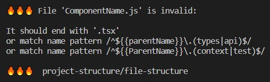

# eslint-plugin-project-structure



Eslint plugin that allows you to enforce rules on project structure to keep your repository consistent even in large teams.

### Features

✅ Validation of project structure (Any files/folders outside the structure will be considered an error).<br>
✅ Validation of folder and file names.<br>
✅ Name case validation.<br>
✅ Name regex validation.<br>
✅ File extension validation (Support for all extensions).<br>
✅ Inheriting the parent's name (The child inherits the name of the folder in which it is located).<br>
✅ Folder recursion (You can nest a given folder structure recursively).<br>
✅ Forcing a nested/flat structure for a given folder.

### Go to:

-   [Installation](#installation)
-   [Getting started](#getting-started)
-   [Simple example](#simple-example-for-the-structure-below)
-   [Advanced example](#advanced-example-for-the-structure-below-containing-all-key-features)
-   [API](#api)
    -   [$schema](#schema)
    -   [ignorePatterns](#ignore-patterns)
    -   [name](#name)
        -   [Fixed name](#fixed-name)
        -   [Regex](#regex)
    -   [regexParameters](#regex-parameters)
        -   [Built-in regex parameters](#built-in-regex-parameters)
        -   [Regex parameters mix example](#regex-parameters-mix-example)
    -   [extension](#extension)
    -   [children](#children)
    -   [structure](#structure)
    -   [rules](#rules)
    -   [ruleId](#ruleid)
-   [Folder recursion](#folder-recursion)

## Installation

```bsh
$ yarn add -D eslint-plugin-project-structure
```

```bsh
$ npm i --dev eslint-plugin-project-structure
```

## Getting started

### Step 1 (optional)

If you want to check **[extensions](#extension)** that are not supported by **`eslint`** like **`.css`**, **`.sass`**, **`.less`**, **`.svg`**, **`.png`**, **`.jpg`**, **`.ico`**, **`.yml`**, **`.json`** etc., read the step below, if not go to the **[next step](#step-2)**.<br>

Add the following lines to **`.eslintrc`**.

```jsonc
 {
    "parserOptions": {
        "project": "./tsconfig.json",
    },
    // Plugins rules that work with all parsers.
    "extends": ["plugin:@typescript-eslint/recommended"],
    // Rules that work with all parsers.
    "rules": [],
    "overrides": [
        // Use eslint-plugin-project-structure parser for the following file extensions. You can extend the list of extensions.
        {
            "files": [
                "*.css",
                "*.sass",
                "*.less",
                "*.svg",
                "*.png",
                "*.jpg",
                "*.ico",
                "*.yml",
                "*.json",
            ],
            "rules":{
                // Here you can disable rules that are not to be executed on additional file extensions or rules that require a different parser.

                // "no-irregular-whitespace": "off",
            },
            "parser": "./node_modules/eslint-plugin-project-structure/dist/parser.js",
        },
         // Use @typescript-eslint/parser for the following file extensions.
        {
            "files": ["*.ts", "*.tsx", "*.js", "*.jsx"],
            "parser": "@typescript-eslint/parser",
            "extends": [
                // If multiple rules from a given plugin require @typescript-eslint/parser,
                // you can extend the entire plugin here instead of disabling individual rules in the eslint-plugin-project-structure parser.

                // "plugin:@typescript-eslint/recommended-requiring-type-checking",
            ],
            "rules": {
                // Here you can add rules that require @typescript-eslint/parser.
                // Then you don't have to disable them for the eslint-plugin-project-structure parser.
            }
        },
    ],
};
```

### Step 2

Add the following lines to **`.eslintrc`**.

```jsonc
{
    "plugins": ["project-structure"],
    "rules": {
        "project-structure/file-structure": "error", // warn | error
    },
    "settings": {
        "project-structure/config-path": "projectStructure.json", // json | yaml
    },
}
```

### Step 3

Create a **`projectStructure.json`** or **`projectStructure.yaml`** in the root of your project.<br>

> [!NOTE]
> You can choose your own file name, just make sure it is the same as in **[Step 2](#step-2)**.

**[Here](https://github.com/Igorkowalski94/eslint-plugin-project-structure/tree/main/examples)** you will find an example of the project structure for the **`framework (CLI)`** you are using. If it's not on the examples list and you want to help the community, add its configuration **[here](https://github.com/Igorkowalski94/eslint-plugin-project-structure/issues/new?assignees=Igorkowalski94&labels=Framework+example&projects=&template=framework-example.md&title=%5BFramework+example%5D)**.<br>

If you want to help:<br>
You can leave a ⭐ and share the link with your friends. It will help grow our community. <br>
You can share your project structure in the **[discussions section](https://github.com/Igorkowalski94/eslint-plugin-project-structure/discussions)** and help create standards for given frameworks. Standards will make moving from one project to another much easier and will increase the overall quality and consistency of projects in our industry.

#### Simple example for the structure below:

```
.
├── ...
├── 📄 projectStructure.json
├── 📄 .eslintrc.json
└── 📂 src
    ├── 📄 index.tsx
    └── 📂 components
        ├── ...
        └── 📄 ComponentName.tsx
```

#### JSON

```jsonc
{
    "structure": {
        "children": [
            {
                "extension": "*",
            },
            {
                "name": "src",
                "children": [
                    {
                        "name": "index",
                        "extension": "tsx",
                    },
                    {
                        "name": "components",
                        "children": [
                            {
                                "name": "/^${{PascalCase}}$/",
                                "extension": "tsx",
                            },
                        ],
                    },
                ],
            },
        ],
    },
}
```

#### YAML

```yaml
structure:
    children:
        - extension: "*"
        - name: src
          children:
              - name: index
                extension: tsx
              - name: components
                children:
                    - name: "/^${{PascalCase}}$/"
                      extension: tsx
```

#### Advanced example for the structure below, containing all key features:

```
.
├── ...
├── 📄 projectStructure.json
├── 📄 .eslintrc.json
└── 📂 src
    ├── 📂 hooks
    │   ├── ...
    │   ├── 📄 useSimpleGlobalHook.test.ts
    │   ├── 📄 useSimpleGlobalHook.ts
    │   └── 📂 useComplexGlobalHook
    │       ├── 📁 hooks (recursion)
    │       ├── 📄 useComplexGlobalHook.api.ts
    │       ├── 📄 useComplexGlobalHook.types.ts
    │       ├── 📄 useComplexGlobalHook.test.ts
    │       └── 📄 useComplexGlobalHook.ts
    └── 📂 components
        ├── ...
        └── 📂 ParentComponent
            ├── 📄 parentComponent.api.ts
            ├── 📄 parentComponent.types.ts
            ├── 📄 ParentComponent.context.tsx
            ├── 📄 ParentComponent.test.tsx
            ├── 📄 ParentComponent.tsx
            ├── 📂 components
            │   ├── ...
            │   └── 📂 ChildComponent
            │       ├── 📁 components (recursion)
            │       ├── 📁 hooks (recursion)
            │       ├── 📄 childComponent.types.ts
            │       ├── 📄 childComponent.api.ts
            │       ├── 📄 ChildComponent.context.tsx
            │       ├── 📄 ChildComponent.test.tsx
            │       └── 📄 ChildComponent.tsx
            └── 📂 hooks
                ├── ...
                ├── 📄 useSimpleParentComponentHook.test.ts
                ├── 📄 useSimpleParentComponentHook.ts
                └── 📂 useComplexParentComponentHook
                    ├── 📁 hooks (recursion)
                    ├── 📄 useComplexParentComponentHook.api.ts
                    ├── 📄 useComplexParentComponentHook.types.ts
                    ├── 📄 useComplexParentComponentHook.test.ts
                    └── 📄 useComplexParentComponentHook.ts
```

#### JSON

```jsonc
{
    "$schema": "node_modules/eslint-plugin-project-structure/projectStructure.schema.json",
    "ignorePatterns": ["src/legacy/*"],
    "structure": {
        "children": [
            {
                "extension": "*",
            },
            {
                "name": "src",
                "children": [
                    {
                        "ruleId": "hooks_folder",
                    },
                    {
                        "ruleId": "components_folder",
                    },
                ],
            },
        ],
    },
    "rules": {
        "components_folder": {
            "name": "components",
            "children": [
                {
                    "ruleId": "component_folder",
                },
            ],
        },
        "hooks_folder": {
            "name": "hooks",
            "children": [
                {
                    "name": "/^use${{PascalCase}}$/",
                    "children": [
                        {
                            "ruleId": "hooks_folder",
                        },
                        {
                            "name": "/^${{parentName}}(\\.(test|api|types))?$/",
                            "extension": "ts",
                        },
                    ],
                },
                {
                    "name": "/^use${{PascalCase}}(\\.test)?$/",
                    "extension": "ts",
                },
            ],
        },
        "component_folder": {
            "name": "/^${{PascalCase}}$/",
            "children": [
                {
                    "ruleId": "components_folder",
                },
                {
                    "ruleId": "hooks_folder",
                },
                {
                    "name": "/^${{parentName}}${{yourCustomRegexParameter}}$/",
                    "extension": ".ts",
                },
                {
                    "name": "/^${{ParentName}}(\\.(context|test))?$/",
                    "extension": ".tsx",
                },
            ],
        },
    },
    "regexParameters": {
        "yourCustomRegexParameter": "\\.(types|api)",
    },
}
```

#### YAML

```yaml
ignorePatterns:
    - src/legacy/*
structure:
    children:
        - extension: "*"
        - name: src
          children:
              - ruleId: hooks_folder
              - ruleId: components_folder
rules:
    components_folder:
        name: components
        children:
            - ruleId: component_folder
    hooks_folder:
        name: hooks
        children:
            - name: "/^use${{PascalCase}}$/"
              children:
                  - ruleId: hooks_folder
                  - name: "/^${{parentName}}(\\.(test|api|types))?$/"
                    extension: ts
            - name: "/^use${{PascalCase}}(\\.test)?$/"
              extension: ts
    component_folder:
        name: "/^${{PascalCase}}$/"
        children:
            - ruleId: components_folder
            - ruleId: hooks_folder
            - name: "/^${{parentName}}${{yourCustomRegexParameter}}$/"
              extension: ".ts"
            - name: "/^${{ParentName}}(\\.(context|test))?$/"
              extension: ".tsx"
regexParameters:
    yourCustomRegexParameter: "\\.(types|api)"
```

## API:

### **`"$schema"`**: `<string | undefined>` <a id="schema"></a>

Type checking for your **`projectStructure.json`**. It helps to fill configuration correctly.

```jsonc
{
    "$schema": "node_modules/eslint-plugin-project-structure/projectStructure.schema.json",
    // ...
}
```

### **`"ignorePatterns"`**: `<string[] | undefined>` <a id="ignore-patterns"></a>

Here you can set the paths you want to ignore.

```jsonc
{
    "ignorePatterns": ["src/legacy/*"],
    // ...
}
```

### **`"name"`**: `<string | undefined>` <a id="name"></a>

When used with **[children](#children)** this will be the name of **`folder`**.<br>
When used with **[extension](#extension)** this will be the name of **`file`**.<br>
If used without **[children](#children)** and **[extension](#extension)** this will be name of **`folder`** and **`file`**.<br>

> [!NOTE]
> If you only care about the name of the **`folder`** without rules for its **[children](#children)**, leave the **[children](#children)** as **`[]`**.

> [!NOTE]
> If you only care about the name of the **`file`** without rules for its **[extension](#extension)**, leave the **[extension](#extension)** as **`"*"`**.

#### Fixed name <a id="fixed-name"></a>

Fixed **`file`**/**`folder`** name.

```jsonc
{
    "name": "FixedName",
    // ...
}
```

#### Regex <a id="regex"></a>

Dynamic **`file`**/**`folder`** name.<br>
Remember that the regular expression must start and end with a **`/`**.

```jsonc
{
    "name": "/^Regex logic$/",
    // ...
}
```

### **`"regexParameters"`**: `<Record<string, string> | undefined>` <a id="regex-parameters"></a>

A place where you can add your own regex parameters.<br>
You can use **[built-in regex parameters](#built-in-regex-parameters)**. You can overwrite them with your logic, exceptions are **[parentName](#parent-name-lower)** and **[ParentName](#parent-name-upper)** overwriting them will be ignored.<br>
You can freely mix regex parameters together see **[example](#regex-parameters-mix-example)**.

```jsonc
{
    "regexParameters": {
        "yourCustomRegexParameter": "(Regex logic)",
        "camelCase": "(Regex logic)", // Override built-in camelCase.
        "parentName": "(Regex logic)", // Overwriting will be ignored.
        "ParentName": "(Regex logic)", // Overwriting will be ignored.
        // ...
    },
    // ...
}
```

Then you can use them in **[regex](#regex)** with the following notation **`${{yourCustomRegexParameter}}`**.

```jsonc
{
    "name": "/^${{yourCustomRegexParameter}}$/",
    // ...
}
```

> [!NOTE]
> Remember that the regular expression must start and end with a **`/`**.

> [!NOTE]
> If your parameter will only be part of the **[regex](#regex)**, I recommend wrapping it in parentheses and not adding **`/^$/`**.

#### Built-in regex parameters

**`${{parentName}}`**<a id="parent-name-lower"></a><br>
The child inherits the name of the **`folder`** in which it is located and sets its **first letter** to **`lowercase`**.

```jsonc
{
    "name": "/^${{parentName}}$/",
}
```

**`${{ParentName}}`**<a id="parent-name-upper"></a><br>
The child inherits the name of the **`folder`** in which it is located and sets its **first letter** to **`uppercase`**.

```jsonc
{
    "name": "/^${{ParentName}}$/",
}
```

**`${{PascalCase}}`**<br>
Add **`PascalCase`** validation to your regex.<br>
The added regex is **`((([A-Z]|\d){1}([a-z]|\d)*)*([A-Z]|\d){1}([a-z]|\d)*)`**.

```jsonc
{
    "name": "/^${{PascalCase}}$/",
}
```

**`${{camelCase}}`**<br>
Add **`camelCase`** validation to your regex.<br>
The added regex is **`(([a-z]|\d)+(([A-Z]|\d){1}([a-z]|\d)*)*)`**.

```jsonc
{
    "name": "/^${{camelCase}}$/",
}
```

**`${{snake_case}}`**<br>
Add **`snake_case`** validation to your regex.<br>
The added regex is **`((([a-z]|\d)+_)*([a-z]|\d)+)`**.

```jsonc
{
    "name": "/^${{snake_case}}$/",
}
```

**`${{kebab-case}}`**<br>
Add **`kebab-case`** validation to your regex.<br>
The added regex is **`((([a-z]|\d)+-)*([a-z]|\d)+)`**.

```jsonc
{
    "name": "/^${{kebab-case}}$/",
}
```

**`${{dash-case}}`**<br>
Add **`dash-case`** validation to your regex.<br>
The added regex is **`((([a-z]|\d)+-)*([a-z]|\d)+)`**.

```jsonc
{
    "name": "/^${{dash-case}}$/",
}
```

#### Regex parameters mix example <a id="regex-parameters-mix-example"></a>

Here are some examples of how easy it is to combine **[regex parameters](#regex-parameters)**.

```jsonc
{
    // useNiceHook
    // useNiceHook.api
    // useNiceHook.test
    "name": "/^use${{PascalCase}}(\\.(test|api))?$/",
}
```

```jsonc
{
    // YourParentName.hello_world
    // YourParentName.hello_world.test
    // YourParentName.hello_world.api
    "name": "/^${{ParentName}}\\.${{snake_case}}(\\.(test|api))?$/",
}
```

### **`"extension"`**: `<string | string[] | undefined>` <a id="extension"></a>

Extension of your **`file`**.<br>
Not available when **[children](#children)** are used.

```jsonc
{
    "extension": ["*", ".ts", ".tsx", "js", "jsx", "..."],
    // ...
}
```

> [!WARNING]
> If you want to check extensions that are not supported by **`eslint`** like **`.css`**, **`.sass`**, **`.less`**, **`.svg`**, **`.png`**, **`.jpg`**, **`.ico`**, **`.yml`**, **`.json`** go to **[Step 1](#step-1-optional)**.

> [!NOTE]
> You don't need to add **`.`** it is optional.

> [!NOTE]
> If you want to include all extensions use **`*`**.

### **`"children"`**: `<Rule[] | undefined>` <a id="children"></a>

**`Folder`** children rules.<br>
Not available when **[extension](#extension)** is used.

```jsonc
{
    "children": [
        {
            "name": "Child",
            // ...
        },
        // ...
    ],
    // ...
}
```

### **`"structure"`**: `<Rule>` <a id="structure"></a>

The structure of your project and its rules.

```
.
├── 📂 libs
├── 📂 src
├── 📂 yourCoolFolderName
└── 📄 ...
```

```jsonc
{
    "structure": {
        "children": [
            {
                "name": "libs",
                "children": [
                    // ...
                ],
            },
            {
                "name": "src",
                "children": [
                    // ...
                ],
            },
            {
                "name": "yourCoolFolderName",
                "children": [
                    // ...
                ],
            },
            {
                "extension": "*", // All files located in the root of your project, like package.json, .eslintrc, etc. You can specify them more precisely.
            },
            // ...
        ],
    },
    // ...
}
```

> [!WARNING]
> Make sure your **`tsconfig`**/**`.eslintrc`** contains all the **`files`**/**`folders`** you want to validate. Otherwise **`eslint`** will not take them into account.

### **`"rules"`**: `<Record<string, Rule> | undefined>` <a id="rules"></a>

A place where you can add your custom rules. This is useful when you want to avoid a lot of repetition in your **[structure](#structure)** or use **[folder recursion](#folder-recursion)** feature.<br>
The key in the object will correspond to **[ruleId](#ruleid)**, which you can then use in many places.

```jsonc
{
    "rules": {
        "yourCustomRule": {
            "name": "ComponentName",
            "children": [
                // ...
            ],
        },
        // ...
    },
    // ...
}
```

### **`"ruleId"`**: `<string | undefined>` <a id="ruleid"></a>

A reference to your custom rule.

```jsonc
{
    "ruleId": "yourCustomRule",
    // ...
}
```

You can use it with other keys like **[name](#name)**, **[extension](#extension)** and **[children](#children)** but remember that they will **override** the keys from your custom rule.<br>
This is useful if you want to get rid of a lot of repetition in your structure, for example, **`folders`** have different **[name](#name)**, but the same **[children](#children)**.

```
.
├── ...
└── 📂 src
    ├── 📂 folder1
    │   ├── ...
    │   └── 📂 NestedFolder
    │       ├── ...
    │       ├── 📄 File1.tsx
    │       └── 📄 file2.ts
    └── 📂 folder2
        ├── 📂 subFolder1
        │    ├── ...
        │    ├── 📄 File1.tsx
        │    └── 📄 file2.ts
        └── 📂 subFolder2
            ├── ...
            ├── 📄 File1.tsx
            └── 📄 file2.ts
```

```jsonc
{
    "structure": {
        "children": [
            {
                "name": "src",
                "children": [
                    {
                        "name": "folder1",
                        "children": [
                            {
                                "name": "/^${{PascalCase}}$/",
                                "ruleId": "shared_children",
                            },
                        ],
                    },
                    {
                        "name": "folder2",
                        "children": [
                            {
                                "name": "/^(subFolder1|subFolder2)$/",
                                "ruleId": "shared_children",
                            },
                        ],
                    },
                ],
            },
            // ...
        ],
    },
    "rules": {
        "shared_children": {
            "children": [
                {
                    "name": "/^${{PascalCase}}$/",
                    "extension": ".tsx",
                },
                {
                    "name": "/^${{camelCase}}$/",
                    "extension": ".ts",
                },
            ],
        },
        // ...
    },
    // ...
}
```

## Folder recursion

You can easily create recursions when you refer to the same **[ruleId](#ruleid)** that your rule has.<br><br>
Suppose your **`folder`** is named **`ComponentFolder`** which satisfies the rule **`${{PascalCase}}`** and your next **`folder`** will be
**`NextComponentFolder`** which also satisfies the rule **`${{PascalCase}}`**. In this case, the recursion will look like this:

```
.
├── ...
└── 📂 src
    └── 📂 ComponentFolder
        ├── ...
        └── 📂 components
            ├── ...
            └── 📁 NextComponentFolder
                ├── ...
                └── 📂 components
                    └── ... (recursion)
```

```jsonc
{
    "structure": {
        "children": [
            {
                "name": "src",
                "children": [
                    {
                        "ruleId": "yourCustomRule",
                    },
                ],
            },
            // ...
        ],
    },
    "rules": {
        "yourCustomRule": {
            "name": "/^${{PascalCase}}$/",
            "children": [
                {
                    "name": "components",
                    "children": [
                        {
                            "ruleId": "yourCustomRule",
                        },
                        // ...
                    ],
                },
                // ...
            ],
        },
        // ...
    },
    // ...
}
```
