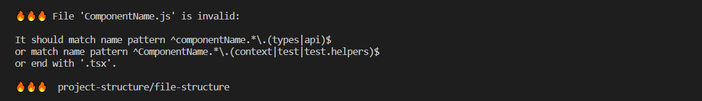

# eslint-plugin-project-structure



Eslint plugin that allows you to enforce rules on project structure to keep your repository consistent even in large teams.

### Features

- Validation of folder and file names
- Name case validation
- Regex validation
- File extension validation
- Inheriting the parent's name (the child inherits the name of the folder in which it is located)
- Folder recursion

# API:

```jsonc
{
  // Type checking.
  // Optional.
  "$schema": "node_modules/eslint-plugin-project-structure/dist/projectStructurerc.schema.json",

  // Required.
  "ignorePatterns": ["src/legacy/*"],

  // Structure of your project.
  // Required.
  "structure": {
    // Fixed name or name object.
    // Optional.
    "name": "features",

    // Optional.
    "type": "folder",

    // Only available when 'type' is folder/not set.
    // Optional.
    // Required when 'type' is folder.
    "children": [
      {
        // Fixed name or name object.
        // Optional.
        "name": {
          // Only available when 'case' not used. Must start and end with /
          "regex": "/^.*\\.(types|api)$/",

          // "PascalCase" or "camelCase" or "snake_case" or "kebab-case" or "dash-case".
          // Only available when 'regex' and 'inheritParentName' not used.
          // Optional.
          "case": "PascalCase",

          // firstLetterUppercase or firstLetterLowercase.
          // Inherits the name of its parent and sets its first letter to lowercase or uppercase.
          // When used with a regex, the parent name will be pasted after the ^ character.
          // Only available when 'case' not used.
          // Optional.
          "inheritParentName": "firstLetterUppercase"
        },

        // Optional.
        "type": "file",

        // .tsx or [".tsx", ".ts" ...]
        // Optional.
        "extension": ".tsx"
      },

      // A reference to your custom rule.
      // Only available when other keys are not used in object.
      // Optional.
      { "id": "myCustomRule" }
    ]
  },
  // Our custom reusable rules.
  // Required.
  "rules": {
    // Your custom rule 'id'.
    // Optional.
    "myCustomRule": {
      //...
    }
  }
}
```

# Installation

```bsh
$ yarn add -D eslint-plugin-project-structure
```

or

```bsh
$ npm i --dev eslint-plugin-project-structure
```

# Getting started

1. Add the following lines to .eslintrc

```jsonc
{
  "plugins": ["project-structure"],
  "rules": {
    "project-structure/file-structure": "error" // warn | error
  },
  "settings": {
    "project-structure/config-path": ".projectStructurerc"
  }
}
```

2. Create a `.projectStructurerc` file in the root of your project.

## Example json:

```json
{
  "$schema": "../../node_modules/eslint-plugin-project-structure/dist/projectStructurerc.schema.json",
  "ignorePatterns": ["src/legacy/*"],
  "structure": {
    "children": [
      {
        "name": "src",
        "type": "folder",
        "children": [
          {
            "name": "features",
            "type": "folder",
            "children": [
              {
                "id": "component_file"
              },
              {
                "id": "component_folder"
              }
            ]
          }
        ]
      }
    ]
  },
  "rules": {
    "component_file": {
      "name": {
        "case": "PascalCase"
      },
      "type": "file",
      "extension": ".tsx"
    },
    "component_folder": {
      "type": "folder",
      "name": {
        "case": "PascalCase"
      },
      // It will be ParentName/components/ChildComponent.tsx or ParentName/components/ChildComponent/ChildComponent.tsx ... (recursion).
      "children": [
        {
          "name": "components",
          "type": "folder",
          "children": [
            {
              "id": "component_file"
            },
            {
              "id": "component_folder" // This way you can create recursions
            }
          ]
        },
        {
          // With 'inheritParentName' it will be ParentName.test.tsx or ParentName.context.tsx or ParentName.test.js or ParentName.context.js
          "name": {
            "inheritParentName": "firstLetterUppercase",
            "regex": "/^.*\\.(context|test)$/"
          },
          "type": "file",
          "extension": [".tsx", "js"]
        },
        {
          // For example componentName.types.ts or ComponentName.api.ts,
          "name": {
            "regex": "/^.*\\.(types|api)$/"
          },
          "type": "file",
          "extension": ".ts"
        },
        {
          // For example ComponentName.tsx
          "name": {
            "case": "PascalCase"
          },
          "type": "file",
          "extension": ".tsx"
        }
      ]
    }
  }
}
```

## Example yaml:

```yaml
---
ignorePatterns:
  - src/legacy/*
structure:
  children:
    - name: src
      type: folder
      children:
        - name: features
          type: folder
          children:
            - id: component_file
            - id: component_folder
rules:
  component_file:
    name:
      case: PascalCase
    type: file
    extension: ".tsx"
  component_folder:
    type: folder
    name:
      case: PascalCase
    children:
      - name: components
        type: folder
        children:
          - id: component_file
          - id: component_folder
      - name:
          inheritParentName: firstLetterUppercase
          regex: "/^.*\\.(context|test)$/"
        type: file
        extension:
          - ".tsx"
          - js
      - name:
          regex: "/^.*\\.(types|api)$/"
        type: file
        extension: ".ts"
      - name:
          case: PascalCase
        type: file
        extension: ".tsx"
```
