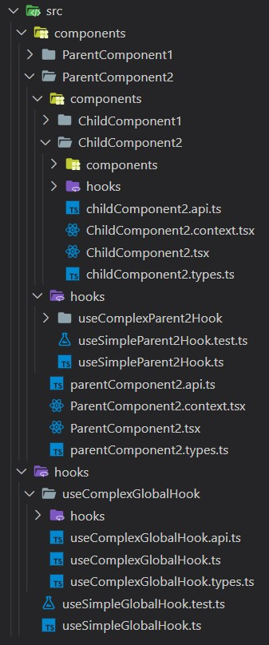

# eslint-plugin-project-structure


Eslint plugin that allows you to enforce rules on project structure to keep your repository consistent even in large teams.

### Features

✅ Validation of project structure.<br>
✅ Validation of folder and file names.<br>
✅ Name case validation.<br>
✅ Name regex validation.<br>
✅ File extension validation.<br>
✅ Inheriting the parent's name (the child inherits the name of the folder in which it is located).<br>
✅ Folder recursion.<br>
✅ Forcing a nested/flat structure.

### Go to:

-   [Installation](#installation)
-   [JSON example](#json-example-for-the-structure-below)
-   [YAML example](#yaml-example)
-   [API](#api)
    -   [$schema](#schema)
    -   [ignorePatterns](#ignore-patterns)
    -   [name](#name)
        -   [Fixed name](#fixed-name)
        -   [Regex](#regex)
        -   [Regex parameters](#regex-parameters)
        -   [Regex parameters mix example](#regex-parameters-mix-example)
    -   [extension](#extension)
    -   [children](#children)
    -   [structure](#structure)
    -   [rules](#rules)
    -   [ruleId](#ruleid)
-   [Folder recursion](#folder-recursion)

## Installation

```bsh
$ yarn add -D eslint-plugin-project-structure
```

or

```bsh
$ npm i --dev eslint-plugin-project-structure
```

## Getting started

Add the following lines to .eslintrc

```jsonc
{
    "plugins": ["project-structure"],
    "rules": {
        "project-structure/file-structure": "error" // warn | error
    },
    "settings": {
        "project-structure/config-path": ".projectStructurerc"
    }
}
```

Create a `.projectStructurerc` file in the root of your project.

#### JSON example for the structure below:

<p align="center">

</p>

```jsonc
{
    "$schema": "node_modules/eslint-plugin-project-structure/projectStructurerc.schema.json",
    "ignorePatterns": ["src/legacy/*"],
    "structure": {
        "name": "src",
        "children": [
            {
                "name": "features",
                "children": [
                    {
                        "ruleId": "component_folder"
                    }
                ]
            }
        ]
    },
    "rules": {
        "component_folder": {
            "name": "/^${{PascalCase}}?$/",
            "children": [
                {
                    "name": "components",
                    "children": [
                        {
                            "ruleId": "component_folder"
                        }
                    ]
                },
                {
                    "name": "/^${{ParentName}}(?:\\.(context|test))?$/",
                    "extension": [".tsx", "ts"]
                },
                {
                    "name": "/^${{parentName}}(?:\\.(types|api))?$/",
                    "extension": ".ts"
                },
                {
                    "name": "/^${{ParentName}}$/",
                    "extension": ".tsx"
                }
            ]
        }
    }
}
```

#### YAML Example

```yaml
ignorePatterns:
    - src/legacy/*
structure:
    name: src
    children:
        - name: features
          children:
              - ruleId: component_folder
rules:
    component_folder:
        name: "/^${{PascalCase}}?$/"
        children:
            - name: components
              children:
                  - ruleId: component_folder
            - name: "/^${{ParentName}}(?:\\.(context|test))?$/"
              extension:
                  - ".tsx"
                  - ts
            - name: "/^${{parentName}}(?:\\.(types|api))?$/"
              extension: ".ts"
            - name: "/^${{ParentName}}$/"
              extension: ".tsx"
```

## API:

### **`"$schema"`**: `<string | undefined>` <a id="schema"></a>

Type checking for your `.projectStructurerc`. It helps to fill configuration correctly.

```jsonc
{
    "$schema": "node_modules/eslint-plugin-project-structure/projectStructurerc.schema.json"
}
```

### **`"ignorePatterns"`**: `<string[] | undefined>` <a id="ignore-patterns"></a>

Here you can set the paths you want to ignore.

```jsonc
{
    "ignorePatterns": ["src/legacy/*"]
}
```

### **`"name"`**: `<string | undefined>` <a id="name"></a>

When used with [**`children`**](#children) this will be the name of `folder`.<br>
When used with [**`extension`**](#extension) this will be the name of `file`.<br>
If used without [**`children`**](#children) and [**`extension`**](#extension) this will be name of `folder` and `file`.<br>

> **Note**
> If you only care about the name of the `folder` without rules for its [**`children`**](#children), leave the [**`children`**](#children) as `[]`.

#### Fixed name <a id="fixed-name"></a>

Fixed file/folder name.

```jsonc
{
    "name": "Fixed"
}
```

#### Regex <a id="regex"></a>

Dynamic file/folder name.<br>
Remember that the regular expression must start and end with a **`/`**.

```jsonc
{
    "name": "/^(Your regex logic)$/"
}
```

#### Regex parameters <a id="regex-parameters"></a>

You can use built-in parameters for regex. You can freely mix them together see **[example](#regex-parameters-mix-example)**.

**`${{parentName}}`**<br>
The child inherits the name of the folder in which it is located and sets its first letter to lowercase.

```jsonc
{
    "name": "/^${{parentName}}$/"
}
```

**`${{ParentName}}`**<br>
The child inherits the name of the folder in which it is located and sets its first letter to uppercase.

```jsonc
{
    "name": "/^${{ParentName}}$/"
}
```

**`${{PascalCase}}`**<br>
Add `PascalCase` validation to your regex.<br>
The added regex is `((([A-Z]|\d){1}([a-z]|\d)*)*([A-Z]|\d){1}([a-z]|\d)*)`.

```jsonc
{
    "name": "/^${{PascalCase}}$/"
}
```

**`${{camelCase}}`**<br>
Add `camelCase` validation to your regex.<br>
The added regex is `(([a-z]|\d)+(([A-Z]|\d){1}([a-z]|\d)*)*)`.

```jsonc
{
    "name": "/^${{camelCase}}$/"
}
```

**`${{snake_case}}`**<br>
Add `snake_case` validation to your regex.<br>
The added regex is `((([a-z]|\d)+_)*([a-z]|\d)+)`.

```jsonc
{
    "name": "/^${{snake_case}}$/"
}
```

**`${{kebab-case}}`**<br>
Add `kebab-case` validation to your regex.<br>
The added regex is `((([a-z]|\d)+-)*([a-z]|\d)+)`.

```jsonc
{
    "name": "/^${{kebab-case}}$/"
}
```

**`${{dash-case}}`**<br>
Add `dash-case` validation to your regex.<br>
The added regex is `((([a-z]|\d)+-)*([a-z]|\d)+)`.

```jsonc
{
    "name": "/^${{dash-case}}$/"
}
```

#### Regex parameters mix example <a id="regex-parameters-mix-example"></a>

Here are some examples of how easy it is to combine **[regex parameters](#regex-parameters)**.

```jsonc
{
    // useNiceHook
    // useNiceHook.api
    // useNiceHook.test
    "name": "/^(use)${{PascalCase}}(?:\\.(test|api))?$/"
}
```

```jsonc
{
    // YourParentName.hello_world
    // YourParentName.hello_world.test
    // YourParentName.hello_world.api
    "name": "/^${{ParentName}}(.)${{snake_case}}(?:\\.(test|api))?$/"
}
```

### **`"extension"`**: `<string | string[] | undefined>` <a id="extension"></a>

Extension of your file.<br>
Not available when [**`children`**](#children) are used.

```jsonc
{
    "extension": ["*", ".ts", ".tsx", "js", "jsx", "..."]
}
```

> **Note**
> You don't need to add **`.`** it is optional.

> **Note**
> If you want to include all extensions use `*`.

### **`"children"`**: `<Rule[] | undefined>` <a id="children"></a>

Folder children rules.<br>
Not available when [**`extension`**](#extension) is used.

```jsonc
{
    "children": [
        {
            "name": "Child"
        }
        // ...
    ]
}
```

### **`"structure"`**: `<Rule>` <a id="structure"></a>

The structure of your project and its rules.

```jsonc
{
    "structure": {
        "name": "src",
        "children": [
            // ...
        ]
    }
}
```

### **`"rules"`**: `<Record<string, Rule> | undefined>` <a id="rules"></a>

A place where you can add your custom rules.<br>
The key in the object will correspond to [**`ruleId`**](#ruleid), which you can then use in many places.

```jsonc
{
    "rules": {
        "yourCustomRule": {
            "name": "ComponentName",
            "children": [
                // ...
            ]
        }
        // ...
    }
}
```

### **`"ruleId"`**: `<string | undefined>` <a id="ruleid"></a>

A reference to your custom rule.<br>
Only available when other keys are not used in object.

```jsonc
{
    "ruleId": "yourCustomRule"
}
```

## Folder recursion

You can easily create recursions when you refer to the same [**`ruleId`**](#ruleid) that your rule has.<br><br>
Suppose your folder is named **`ComponentFolder`** which satisfies the rule **`${{PascalCase}}`** and your next folder will be
**`NextComponentFolder`** which also satisfies the rule **`${{PascalCase}}`**. In this case, the recursion will look like this:<br>
**`src/features/ComponentFolder/components/NextComponentFolder/components... (recursion)`**.

```jsonc
{
    "structure": {
        "name": "src",
        "children": [
            {
                "name": "features",
                "children": [
                    {
                        "ruleId": "yourCustomRule"
                    }
                    // ...
                ]
            }
            // ...
        ]
    },
    "rules": {
        "yourCustomRule": {
            "name": "/^${{PascalCase}}?$/",
            "children": [
                {
                    "name": "components",
                    "children": [
                        {
                            "ruleId": "yourCustomRule"
                        }
                        // ...
                    ]
                }
                // ...
            ]
        }
        // ...
    }
}
```
